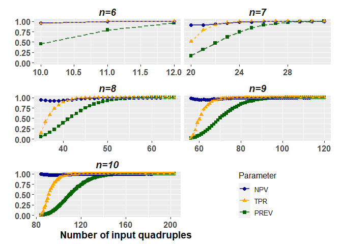
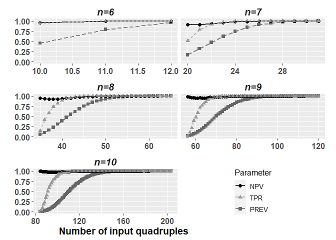

Create Supplemental Figure
================
Janne Pott
2023-06-25

Here I only want to generate the plot for the publication (in black and
white, and in color for online supplement).

``` r
rm(list = ls())
time0<-Sys.time()

source("../SourceFile.R")
```

    ## Warning: package 'ggplot2' was built under R version 4.2.3

    ## Warning: package 'cowplot' was built under R version 4.2.3

``` r
source("../helperFunctions/TestHelpRFunction.R")
source("../helperFunctions/ShiftLegendBarplot.R")

x_lowerBound = c()
x_upperBound = c()

for(i in 6:10){
  #i=7
  min_quad = choose(i,3)/4
  x_lowerBound = c(x_lowerBound,ceiling(min_quad))
  max_quad = choose(i,4) - (i-4)
  x_upperBound = c(x_upperBound,max_quad)
}
```

# Get data

``` r
load("../results/02_SimulationResults_n06.RData")
load("../results/02_SimulationResults_n07.RData")
load("../results/02_SimulationResults_n08.RData")
load("../results/02_SimulationResults_n09.RData")
load("../results/02_SimulationResults_n10.RData")

SimulationResults_n06[,n := 6]
SimulationResults_n07[,n := 7]
SimulationResults_n08[,n := 8]
SimulationResults_n09[,n := 9]
SimulationResults_n10[,n := 10]

sim_n6 = SimulationResults_n06[k>=x_lowerBound[1] & k<=x_upperBound[1]]
sim_n7 = SimulationResults_n07[k>=x_lowerBound[2] & k<=x_upperBound[2]]
sim_n8 = SimulationResults_n08[k>=x_lowerBound[3] & k<=x_upperBound[3]]
sim_n9 = SimulationResults_n09[k>=x_lowerBound[4] & k<=x_upperBound[4]]
sim_n10 = SimulationResults_n10[k>=x_lowerBound[5] & k<=x_upperBound[5]]

sim = rbind(sim_n6,sim_n7,sim_n8,sim_n9,sim_n10)
table(sim$n)
```

    ## 
    ##   6   7   8   9  10 
    ##   8  23  52 100 174

# Get contingecy tables

``` r
dumTab3 = foreach(i = 6:10)%do%{
  # i=6
  mySim = copy(sim)
  mySim = mySim[n == i,]
  
  dumTab4 = foreach(k = 1:dim(mySim)[1])%do%{
    # k=1
    myRow = copy(mySim)
    myRow = myRow[k,]
    
    stats_k = TestHelpRFunction(P = myRow$NR_PhyloDec,
                            N = myRow$NR_NotPhyloDec,
                            PP = myRow$NR_FTT)
    stats_k[,n :=i]
    stats_k[,k := myRow$k]
    stats_k
  }
  myStats_k = rbindlist(dumTab4)
  myStats_k
}
myStats_k = rbindlist(dumTab3)

PlotData = copy(myStats_k)
PlotData = PlotData[!is.na(PPV)]

PlotData2 = melt(PlotData, id = c("n","k"),measure.vars = c("Prevalence","NPV","TPR")) 
PlotData2[variable=="Prevalence",variable := "PREV"]
PlotData2[,n2 := paste0("n=",n)]
PlotData2[,n3 := factor(n2, levels=c('n=6','n=7','n=8','n=9',"n=10"))]
setnames(PlotData2,"variable","Parameter")
```

# Plotting in color

``` r
p1 <- ggplot(PlotData2,aes(x=k, y=value, group=Parameter, color = Parameter, shape = Parameter)) +
  facet_wrap(~ n3, 
             nrow = 3, 
             scales = "free_x",
             strip.position = "top") +
  geom_point(size=2)+
  geom_line(aes(linetype=Parameter),linewidth=1,alpha=0.75)+
  theme(strip.background = element_blank(),
        strip.placement = "outside",
        strip.text = element_text(face = "bold.italic"),
        axis.title.x = element_text(size=14,face="bold"),
        axis.title.y = element_text(size=14,face="bold"),
        axis.text = element_text(size=12,face="bold"),
        strip.text.x = element_text(size = 14),
        legend.title = element_text(size = 12),
        legend.text = element_text(size = 10))+
  labs(x="Number of input quadruples                                            ",
       y = "")+
  scale_color_manual(values = c("darkblue","orange","darkgreen")) +
  guides(linetype="none")

grid.draw(ShiftLegendBarplot(p1))
```

    ## Warning: Removed 35 rows containing missing values (`geom_point()`).

    ## Warning: Removed 20 rows containing missing values (`geom_line()`).

<!-- -->

``` r
tiff(filename = "../results/05_Figure_color.tiff", 
     width = 2400, height = 2400, res=300, compression = 'lzw')
grid.draw(ShiftLegendBarplot(p1))
```

    ## Warning: Removed 35 rows containing missing values (`geom_point()`).
    ## Removed 20 rows containing missing values (`geom_line()`).

``` r
dev.off()
```

    ## png 
    ##   2

``` r
png(filename = "../results/05_Figure_color.png", 
     width = 2400, height = 2400, res=300)
grid.draw(ShiftLegendBarplot(p1))
```

    ## Warning: Removed 35 rows containing missing values (`geom_point()`).
    ## Removed 20 rows containing missing values (`geom_line()`).

``` r
dev.off()
```

    ## png 
    ##   2

# Plotting in in black and white

``` r
p2 <- ggplot(PlotData2,aes(x=k, y=value, group=Parameter, color = Parameter, shape = Parameter)) +
  facet_wrap(~ n3, 
             nrow = 3, 
             scales = "free_x",
             strip.position = "top") +
  geom_point(size=2)+
  geom_line(aes(linetype=Parameter),linewidth=1,alpha=0.75)+
  theme(strip.background = element_blank(),
        strip.placement = "outside",
        strip.text = element_text(face = "bold.italic"),
        axis.title.x = element_text(size=14,face="bold"),
        axis.title.y = element_text(size=14,face="bold"),
        axis.text = element_text(size=12,face="bold"),
        strip.text.x = element_text(size = 14),
        legend.title = element_text(size = 12),
        legend.text = element_text(size = 10))+
  labs(x="Number of input quadruples                                            ",
       y = "")+
  scale_color_manual(values = c("black","#999999","#666666")) +
  guides(linetype="none")

grid.draw(ShiftLegendBarplot(p2))
```

    ## Warning: Removed 35 rows containing missing values (`geom_point()`).

    ## Warning: Removed 20 rows containing missing values (`geom_line()`).

<!-- -->

``` r
tiff(filename = "../results/05_Figure_bw.tiff", 
     width = 2400, height = 2400, res=300, compression = 'lzw')
grid.draw(ShiftLegendBarplot(p2))
```

    ## Warning: Removed 35 rows containing missing values (`geom_point()`).
    ## Removed 20 rows containing missing values (`geom_line()`).

``` r
dev.off()
```

    ## png 
    ##   2

``` r
png(filename = "../results/05_Figure_bw.png", 
     width = 2400, height = 2400, res=300)
grid.draw(ShiftLegendBarplot(p2))
```

    ## Warning: Removed 35 rows containing missing values (`geom_point()`).
    ## Removed 20 rows containing missing values (`geom_line()`).

``` r
dev.off()
```

    ## png 
    ##   2

# Session Info

``` r
sessionInfo()
```

    ## R version 4.2.2 (2022-10-31 ucrt)
    ## Platform: x86_64-w64-mingw32/x64 (64-bit)
    ## Running under: Windows 10 x64 (build 19045)
    ## 
    ## Matrix products: default
    ## 
    ## locale:
    ## [1] LC_COLLATE=English_United Kingdom.utf8 
    ## [2] LC_CTYPE=English_United Kingdom.utf8   
    ## [3] LC_MONETARY=English_United Kingdom.utf8
    ## [4] LC_NUMERIC=C                           
    ## [5] LC_TIME=English_United Kingdom.utf8    
    ## 
    ## attached base packages:
    ## [1] grid      stats     graphics  grDevices utils     datasets  methods  
    ## [8] base     
    ## 
    ## other attached packages:
    ## [1] cowplot_1.1.1           gtable_0.3.3            ggplot2_3.4.1          
    ## [4] FixingTaxonTraceR_0.0.1 foreach_1.5.2           data.table_1.14.8      
    ## 
    ## loaded via a namespace (and not attached):
    ##  [1] rstudioapi_0.14  knitr_1.42       magrittr_2.0.3   tidyselect_1.2.0
    ##  [5] munsell_0.5.0    colorspace_2.1-0 R6_2.5.1         rlang_1.1.0     
    ##  [9] fastmap_1.1.1    fansi_1.0.4      highr_0.10       dplyr_1.1.0     
    ## [13] tools_4.2.2      xfun_0.37        utf8_1.2.3       cli_3.6.0       
    ## [17] withr_2.5.0      htmltools_0.5.4  iterators_1.0.14 yaml_2.3.7      
    ## [21] digest_0.6.31    tibble_3.2.0     lifecycle_1.0.3  farver_2.1.1    
    ## [25] vctrs_0.5.2      codetools_0.2-18 glue_1.6.2       evaluate_0.20   
    ## [29] rmarkdown_2.20   labeling_0.4.2   compiler_4.2.2   pillar_1.9.0    
    ## [33] generics_0.1.3   scales_1.2.1     pkgconfig_2.0.3

``` r
message("\nTOTAL TIME : " ,round(difftime(Sys.time(),time0,units = "mins"),3)," minutes")
```

    ## 
    ## TOTAL TIME : 0.119 minutes
