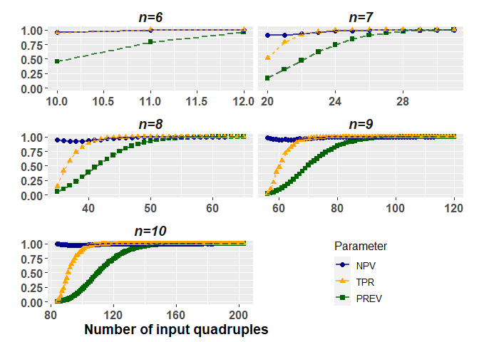
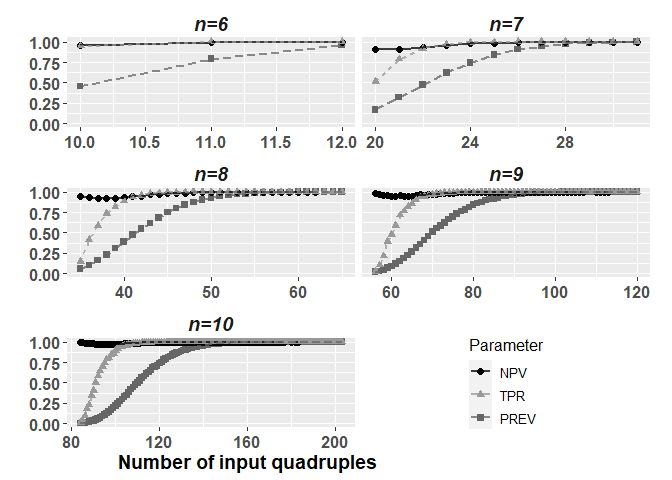
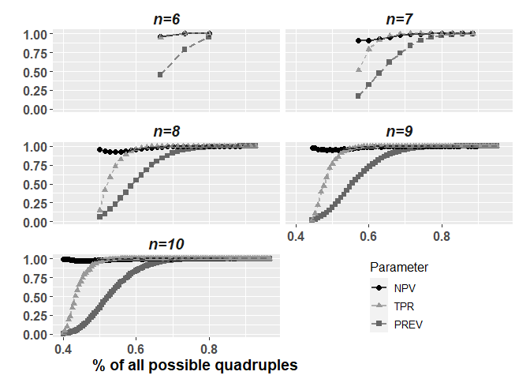
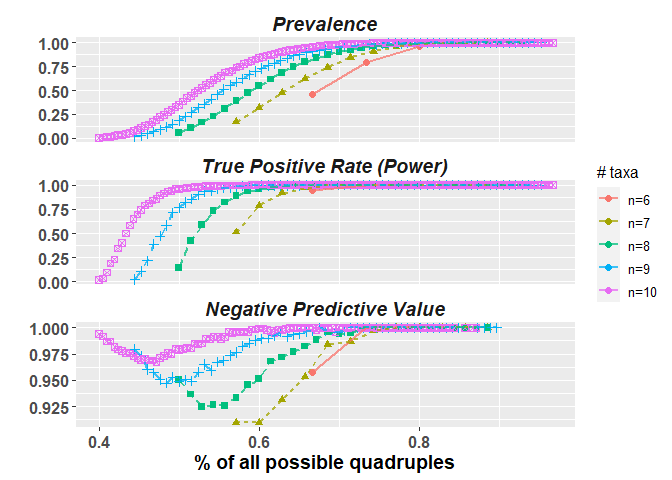

Simulation results
================
Janne Pott
2024-01-09

# Overview

I want to summarize my findings in two tables and one figure.

``` r
rm(list = ls())
time0<-Sys.time()

source("../SourceFile.R")
```

    ## Warning: package 'ggplot2' was built under R version 4.2.3

    ## Warning: package 'cowplot' was built under R version 4.2.3

``` r
source("../helperFunctions/TestHelpRFunction.R")
source("../helperFunctions/ShiftLegendBarplot.R")

x_lowerBound = c()
x_upperBound = c()

for(i in 6:10){
  #i=7
  min_quad = choose(i,3)/4 + 2
  x_lowerBound = c(x_lowerBound,ceiling(min_quad))
  max_quad = choose(i,4) - (i-3)
  x_upperBound = c(x_upperBound,max_quad)
}

load("../results/02_SimulationResults_n06.RData")
load("../results/02_SimulationResults_n07.RData")
load("../results/02_SimulationResults_n08.RData")
load("../results/02_SimulationResults_n09.RData")
load("../results/02_SimulationResults_n10.RData")

SimulationResults_n06[,n := 6]
SimulationResults_n07[,n := 7]
SimulationResults_n08[,n := 8]
SimulationResults_n09[,n := 9]
SimulationResults_n10[,n := 10]

sim_n6 = SimulationResults_n06[k>=x_lowerBound[1] & k<=x_upperBound[1]]
sim_n7 = SimulationResults_n07[k>=x_lowerBound[2] & k<=x_upperBound[2]]
sim_n8 = SimulationResults_n08[k>=x_lowerBound[3] & k<=x_upperBound[3]]
sim_n9 = SimulationResults_n09[k>=x_lowerBound[4] & k<=x_upperBound[4]]
sim_n10 = SimulationResults_n10[k>=x_lowerBound[5] & k<=x_upperBound[5]]

sim = rbind(sim_n6,sim_n7,sim_n8,sim_n9,sim_n10)
table(sim$n)
```

    ## 
    ##   6   7   8   9  10 
    ##   6  21  50  98 172

# Table 1: Summary of simulation performance measures

Median and interquantile range of the true positive rate (TPR), negative
predictive value (NPV) and prevalence (Prev).

First, I get the TPR, NPV and Prev per n and k, and then I calculate the
median and IQR per n. 

``` r
dumTab3 = foreach(i = 6:10)%do%{
  # i=6
  mySim = copy(sim)
  mySim = mySim[n == i,]
  
  dumTab4 = foreach(k = 1:dim(mySim)[1])%do%{
    # k=1
    myRow = copy(mySim)
    myRow = myRow[k,]
    
    stats_k = TestHelpRFunction(P = myRow$NR_PhyloDec,
                            N = myRow$NR_NotPhyloDec,
                            PP = myRow$NR_FTT)
    stats_k[,n :=i]
    stats_k[,k := myRow$k]
    stats_k
  }
  myStats_k = rbindlist(dumTab4)
  myStats_k
}
myStats_k = rbindlist(dumTab3)

tab1 = data.table(n = 6:10)

filt_TPR = !is.na(myStats_k$TPR)
tab6 = myStats_k[n==6 & filt_TPR,summary(TPR)]
tab7 = myStats_k[n==7 & filt_TPR,summary(TPR)]
tab8 = myStats_k[n==8 & filt_TPR,summary(TPR)]
tab9 = myStats_k[n==9 & filt_TPR,summary(TPR)]
tab10 = myStats_k[n==10 & filt_TPR,summary(TPR)]
tab_TPR = rbind(tab6,tab7,tab8,tab9,tab10)
tab1[,TPR := signif(tab_TPR[,3],2)]
tab1[,TPR_IQR := paste0("[",signif(tab_TPR[,2],2),",",signif(tab_TPR[,5],2),"]")]

filt_NPV = !is.na(myStats_k$NPV)
tab6 = myStats_k[n==6 & filt_NPV,summary(NPV)]
tab7 = myStats_k[n==7 & filt_NPV,summary(NPV)]
tab8 = myStats_k[n==8 & filt_NPV,summary(NPV)]
tab9 = myStats_k[n==9 & filt_NPV,summary(NPV)]
tab10 = myStats_k[n==10 & filt_NPV,summary(NPV)]
tab_NPV = rbind(tab6,tab7,tab8,tab9,tab10)
tab1[,NPV := signif(tab_NPV[,3],2)]
tab1[,NPV_IQR := paste0("[",signif(tab_NPV[,2],2),",",signif(tab_NPV[,5],2),"]")]

tab6 = myStats_k[n==6 & Prevalence!=0,summary(Prevalence)]
tab7 = myStats_k[n==7 & Prevalence!=0,summary(Prevalence)]
tab8 = myStats_k[n==8 & Prevalence!=0,summary(Prevalence)]
tab9 = myStats_k[n==9 & Prevalence!=0,summary(Prevalence)]
tab10 = myStats_k[n==10 & Prevalence!=0,summary(Prevalence)]
tab_Prev = rbind(tab6,tab7,tab8,tab9,tab10)
tab1[,Prev := signif(tab_Prev[,3],2)]
tab1[,Prev_IQR := paste0("[",signif(tab_Prev[,2],2),",",signif(tab_Prev[,5],2),"]")]
tab1
```

    ##     n  TPR  TPR_IQR NPV  NPV_IQR Prev    Prev_IQR
    ## 1:  6 0.97 [0.71,1]   1 [0.97,1] 0.62 [0.36,0.83]
    ## 2:  7 0.99 [0.65,1]   1 [0.98,1] 0.74 [0.25,0.96]
    ## 3:  8 1.00  [0.8,1]   1 [0.98,1] 0.85 [0.29,0.99]
    ## 4:  9 1.00 [0.91,1]   1 [0.99,1] 0.91    [0.32,1]
    ## 5: 10 1.00 [0.97,1]   1    [1,1] 0.95    [0.44,1]

``` r
knitr::kable(tab1)
```

|   n |  TPR | TPR_IQR    | NPV | NPV_IQR    | Prev | Prev_IQR      |
|----:|-----:|:-----------|----:|:-----------|-----:|:--------------|
|   6 | 0.97 | \[0.71,1\] |   1 | \[0.97,1\] | 0.62 | \[0.36,0.83\] |
|   7 | 0.99 | \[0.65,1\] |   1 | \[0.98,1\] | 0.74 | \[0.25,0.96\] |
|   8 | 1.00 | \[0.8,1\]  |   1 | \[0.98,1\] | 0.85 | \[0.29,0.99\] |
|   9 | 1.00 | \[0.91,1\] |   1 | \[0.99,1\] | 0.91 | \[0.32,1\]    |
|  10 | 1.00 | \[0.97,1\] |   1 | \[1,1\]    | 0.95 | \[0.44,1\]    |

``` r
knitr::kable(tab1, "latex")
```

# Table 2: Lower and upper bounds of FTT and 4WPP

Bounds on the number $k_n$ of quadruples found in a set S of taxon sets
fulfilling the four-way partition property (4WPP = x) or not (4WPP = -),
or fulfilling fixing taxon traceability (FTT = x) or not (FTT = -).

``` r
load("../results/03_FinalResult.RData")
load("../results/03_4_UpperBound.RData")
dummy = FinalResult[,max(green),by=n]
dummy2 = myResult$green

x1 = myStats_k[Prevalence!=0,min(k),by = n]
y1 = myStats_k[Prevalence<1,max(k),by = n]
x2 = myStats_k[Prevalence!=0 & TPR>0,min(k),by = n]
y2 = sim[posRate<1,max(k),by = n]

tab2 = copy(x1)
setnames(tab2,"V1","k_min_4WPP_sim")
tab2[,k_min_4WPP_theo := x_lowerBound]

tab2[,k_min_FTT_sim := x2$V1]
tab2[,k_min_FTT_theo := choose(n = n-1,3)]

tab2[,k_max_diff_sim := y2$V1]
tab2[,k2_max_diff_sim := dummy$V1]
tab2[,k_max_diff_theo := choose(n = n,4) - 3*n +13]

tab2[,k_max_4WPP_sim := y1$V1]
tab2[,k2_max_4WPP_sim := dummy2]
tab2[,k_max_4WPP_theo := x_upperBound]

tab2 = t(tab2)
knitr::kable(tab2)
```

|                 |     |     |     |     |     |
|:----------------|----:|----:|----:|----:|----:|
| n               |   6 |   7 |   8 |   9 |  10 |
| k_min_4WPP_sim  |   9 |  17 |  30 |  46 |  72 |
| k_min_4WPP_theo |   7 |  11 |  16 |  23 |  32 |
| k_min_FTT_sim   |  10 |  20 |  35 |  56 |  84 |
| k_min_FTT_theo  |  10 |  20 |  35 |  56 |  84 |
| k_max_diff_sim  |  10 |  26 |  50 |  89 | 146 |
| k2_max_diff_sim |  10 |  27 |  59 | 112 | 193 |
| k_max_diff_theo |  10 |  27 |  59 | 112 | 193 |
| k_max_4WPP_sim  |  12 |  31 |  62 | 113 | 183 |
| k2_max_4WPP_sim |  12 |  31 |  65 | 120 | 203 |
| k_max_4WPP_theo |  12 |  31 |  65 | 120 | 203 |

# Figure 1: Performance per k

## Preparation

``` r
PlotData = copy(myStats_k)
PlotData = PlotData[!is.na(PPV)]

PlotData2 = melt(PlotData, 
                 id = c("n","k"),
                 measure.vars = c("Prevalence","NPV","TPR")) 
PlotData2[variable=="Prevalence",variable := "PREV"]
PlotData2[,n2 := paste0("n=",n)]
PlotData2[,n3 := factor(n2, levels=c('n=6','n=7','n=8','n=9',"n=10"))]
setnames(PlotData2,"variable","Parameter")
```

## Plotting in color

``` r
p1 <- ggplot(PlotData2,aes(x=k, y=value, group=Parameter, color = Parameter, shape = Parameter)) +
  facet_wrap(~ n3, 
             nrow = 3, 
             scales = "free_x",
             strip.position = "top") +
  geom_point(size=2)+
  geom_line(aes(linetype=Parameter),linewidth=1,alpha=0.75)+
  theme(strip.background = element_blank(),
        strip.placement = "outside",
        strip.text = element_text(face = "bold.italic"),
        axis.title.x = element_text(size=14,face="bold"),
        axis.title.y = element_text(size=14,face="bold"),
        axis.text = element_text(size=12,face="bold"),
        strip.text.x = element_text(size = 14),
        legend.title = element_text(size = 12),
        legend.text = element_text(size = 10))+
  labs(x="Number of input quadruples                                            ",
       y = "")+
  scale_color_manual(values = c("darkblue","orange","darkgreen")) +
  guides(linetype="none")

grid.draw(ShiftLegendBarplot(p1))
```

    ## Warning: Removed 35 rows containing missing values (`geom_point()`).

    ## Warning: Removed 20 rows containing missing values (`geom_line()`).

<!-- -->

``` r
tiff(filename = "../results/06_Figure_color.tiff", 
     width = 2400, height = 2400, res=300, compression = 'lzw')
grid.draw(ShiftLegendBarplot(p1))
```

    ## Warning: Removed 35 rows containing missing values (`geom_point()`).
    ## Removed 20 rows containing missing values (`geom_line()`).

``` r
dev.off()
```

    ## png 
    ##   2

``` r
png(filename = "../results/06_Figure_color.png", 
     width = 2400, height = 2400, res=300)
grid.draw(ShiftLegendBarplot(p1))
```

    ## Warning: Removed 35 rows containing missing values (`geom_point()`).
    ## Removed 20 rows containing missing values (`geom_line()`).

``` r
dev.off()
```

    ## png 
    ##   2

## Plotting in black and white

``` r
p2 <- ggplot(PlotData2,aes(x=k, y=value, group=Parameter, color = Parameter, shape = Parameter)) +
  facet_wrap(~ n3, 
             nrow = 3, 
             scales = "free_x",
             strip.position = "top") +
  geom_point(size=2)+
  geom_line(aes(linetype=Parameter),linewidth=1,alpha=0.75)+
  theme(strip.background = element_blank(),
        strip.placement = "outside",
        strip.text = element_text(face = "bold.italic"),
        axis.title.x = element_text(size=14,face="bold"),
        axis.title.y = element_text(size=14,face="bold"),
        axis.text = element_text(size=12,face="bold"),
        strip.text.x = element_text(size = 14),
        legend.title = element_text(size = 12),
        legend.text = element_text(size = 10))+
  labs(x="Number of input quadruples                                            ",
       y = "")+
  scale_color_manual(values = c("black","#999999","#666666")) +
  guides(linetype="none")

grid.draw(ShiftLegendBarplot(p2))
```

    ## Warning: Removed 35 rows containing missing values (`geom_point()`).

    ## Warning: Removed 20 rows containing missing values (`geom_line()`).

<!-- -->

``` r
tiff(filename = "../results/06_Figure_bw.tiff", 
     width = 2400, height = 2400, res=300, compression = 'lzw')
grid.draw(ShiftLegendBarplot(p2))
```

    ## Warning: Removed 35 rows containing missing values (`geom_point()`).
    ## Removed 20 rows containing missing values (`geom_line()`).

``` r
dev.off()
```

    ## png 
    ##   2

``` r
png(filename = "../results/06_Figure_bw.png", 
     width = 2400, height = 2400, res=300)
grid.draw(ShiftLegendBarplot(p2))
```

    ## Warning: Removed 35 rows containing missing values (`geom_point()`).
    ## Removed 20 rows containing missing values (`geom_line()`).

``` r
dev.off()
```

    ## png 
    ##   2

## Plotting in percents

``` r
PlotData3 = copy(PlotData2)
PlotData3[n==6,k2 := k/choose(6,4)]
PlotData3[n==7,k2 := k/choose(7,4)]
PlotData3[n==8,k2 := k/choose(8,4)]
PlotData3[n==9,k2 := k/choose(9,4)]
PlotData3[n==10,k2 := k/choose(10,4)]

p3 <- ggplot(PlotData3,aes(x=k2, y=value, group=Parameter, color = Parameter, shape = Parameter)) +
  facet_wrap(~ n3, 
             nrow = 3, 
             scales = "fixed",
             strip.position = "top") +
  geom_point(size=2)+
  geom_line(aes(linetype=Parameter),linewidth=1,alpha=0.75)+
  theme(strip.background = element_blank(),
        strip.placement = "outside",
        strip.text = element_text(face = "bold.italic"),
        axis.title.x = element_text(size=14,face="bold"),
        axis.title.y = element_text(size=14,face="bold"),
        axis.text = element_text(size=12,face="bold"),
        strip.text.x = element_text(size = 14),
        legend.title = element_text(size = 12),
        legend.text = element_text(size = 10))+
  labs(x="% of all possible quadruples                                            ",
       y = "")+
  scale_color_manual(values = c("black","#999999","#666666")) +
  guides(linetype="none")

grid.draw(ShiftLegendBarplot(p3))
```

    ## Warning: Removed 35 rows containing missing values (`geom_point()`).

    ## Warning: Removed 20 rows containing missing values (`geom_line()`).

<!-- -->

``` r
tiff(filename = "../results/06_Figure_bw_perc.tiff", 
     width = 2400, height = 2400, res=300, compression = 'lzw')
grid.draw(ShiftLegendBarplot(p3))
```

    ## Warning: Removed 35 rows containing missing values (`geom_point()`).
    ## Removed 20 rows containing missing values (`geom_line()`).

``` r
dev.off()
```

    ## png 
    ##   2

``` r
png(filename = "../results/06_Figure_bw_perc.png", 
     width = 2400, height = 2400, res=300)
grid.draw(ShiftLegendBarplot(p3))
```

    ## Warning: Removed 35 rows containing missing values (`geom_point()`).
    ## Removed 20 rows containing missing values (`geom_line()`).

``` r
dev.off()
```

    ## png 
    ##   2

## Plotting per n

``` r
PlotData3[Parameter == "PREV",Parameter := "Prevalence"]
PlotData3[Parameter == "TPR",Parameter := "True Positive Rate (Power)"]
PlotData3[Parameter == "NPV",Parameter := "Negative Predictive Value"]

p4 <- ggplot(PlotData3,aes(x=k2, y=value, group=n3, color = n3, shape = n3)) +
  facet_wrap(~ Parameter, 
             nrow = 3, 
             scales = "free_y",
             strip.position = "top") +
  geom_point(size=2)+
  geom_line(aes(linetype=n3),linewidth=1,alpha=0.75)+
  theme(strip.background = element_blank(),
        strip.placement = "outside",
        strip.text = element_text(face = "bold.italic"),
        axis.title.x = element_text(size=14,face="bold"),
        axis.title.y = element_text(size=14,face="bold"),
        axis.text = element_text(size=12,face="bold"),
        strip.text.x = element_text(size = 14),
        legend.title = element_text(size = 12),
        legend.text = element_text(size = 10))+
  labs(x="% of all possible quadruples",
       color = "# taxa",
       y = "")+
  #scale_color_manual(values = c("black","#999999","#666666")) +
  guides(linetype="none",shape="none")

p4
```

    ## Warning: Removed 35 rows containing missing values (`geom_point()`).

    ## Warning: Removed 30 rows containing missing values (`geom_line()`).

<!-- -->

``` r
tiff(filename = "../results/06_Figure_perc_byParameter.tiff", 
     width = 2400, height = 2400, res=300, compression = 'lzw')
p4
```

    ## Warning: Removed 35 rows containing missing values (`geom_point()`).
    ## Removed 30 rows containing missing values (`geom_line()`).

``` r
dev.off()
```

    ## png 
    ##   2

``` r
png(filename = "../results/06_Figure_perc_byParameter.png", 
     width = 2400, height = 2400, res=300)
p4
```

    ## Warning: Removed 35 rows containing missing values (`geom_point()`).
    ## Removed 30 rows containing missing values (`geom_line()`).

``` r
dev.off()
```

    ## png 
    ##   2

# Session Info

``` r
sessionInfo()
```

    ## R version 4.2.2 (2022-10-31 ucrt)
    ## Platform: x86_64-w64-mingw32/x64 (64-bit)
    ## Running under: Windows 10 x64 (build 19045)
    ## 
    ## Matrix products: default
    ## 
    ## locale:
    ## [1] LC_COLLATE=English_United Kingdom.utf8 
    ## [2] LC_CTYPE=English_United Kingdom.utf8   
    ## [3] LC_MONETARY=English_United Kingdom.utf8
    ## [4] LC_NUMERIC=C                           
    ## [5] LC_TIME=English_United Kingdom.utf8    
    ## 
    ## attached base packages:
    ## [1] grid      stats     graphics  grDevices utils     datasets  methods  
    ## [8] base     
    ## 
    ## other attached packages:
    ## [1] cowplot_1.1.1           gtable_0.3.3            ggplot2_3.4.1          
    ## [4] FixingTaxonTraceR_0.0.1 foreach_1.5.2           data.table_1.14.8      
    ## 
    ## loaded via a namespace (and not attached):
    ##  [1] rstudioapi_0.14  knitr_1.42       magrittr_2.0.3   tidyselect_1.2.0
    ##  [5] munsell_0.5.0    colorspace_2.1-0 R6_2.5.1         rlang_1.1.0     
    ##  [9] fastmap_1.1.1    fansi_1.0.4      highr_0.10       dplyr_1.1.0     
    ## [13] tools_4.2.2      xfun_0.37        utf8_1.2.3       cli_3.6.0       
    ## [17] withr_2.5.0      htmltools_0.5.4  iterators_1.0.14 yaml_2.3.7      
    ## [21] digest_0.6.31    tibble_3.2.0     lifecycle_1.0.3  farver_2.1.1    
    ## [25] vctrs_0.5.2      codetools_0.2-18 glue_1.6.2       evaluate_0.20   
    ## [29] rmarkdown_2.20   labeling_0.4.2   compiler_4.2.2   pillar_1.9.0    
    ## [33] generics_0.1.3   scales_1.2.1     pkgconfig_2.0.3

``` r
message("\nTOTAL TIME : " ,round(difftime(Sys.time(),time0,units = "mins"),3)," minutes")
```

    ## 
    ## TOTAL TIME : 0.259 minutes
